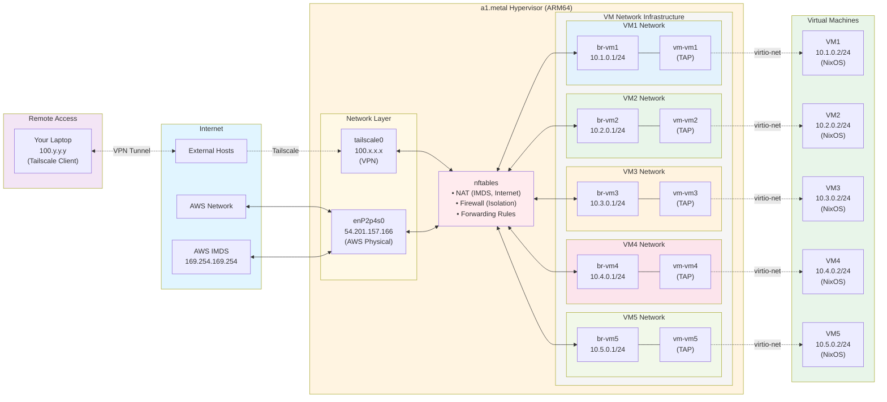
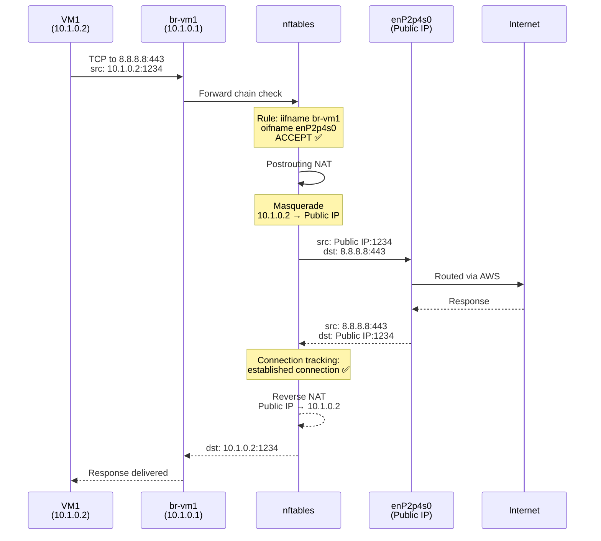
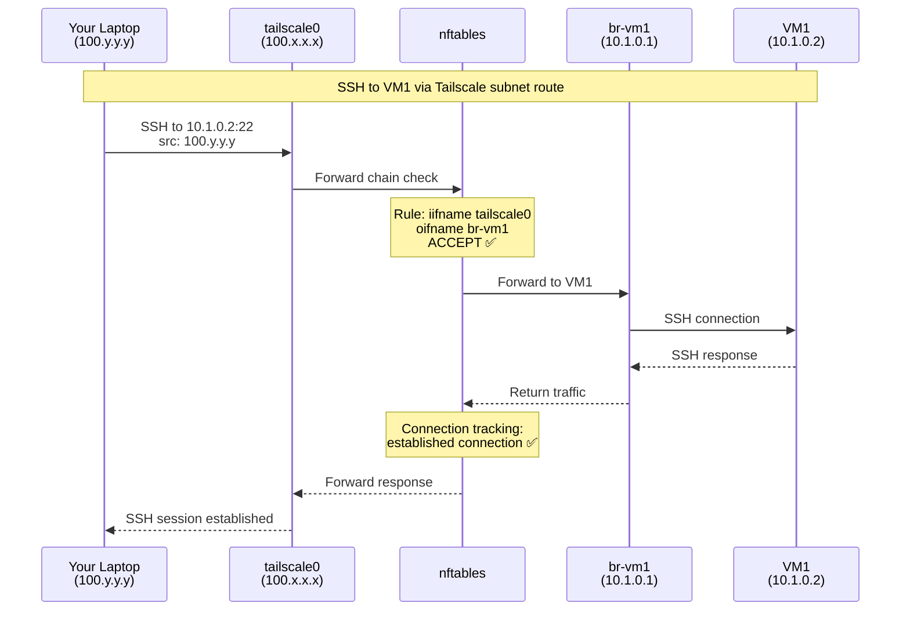
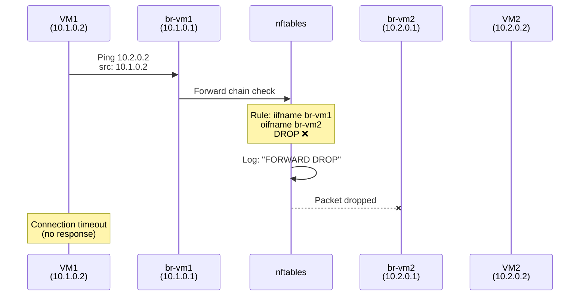
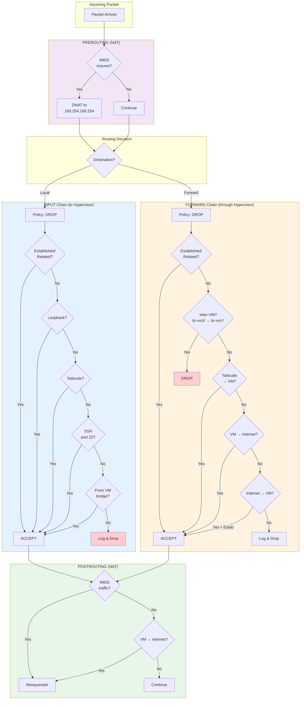
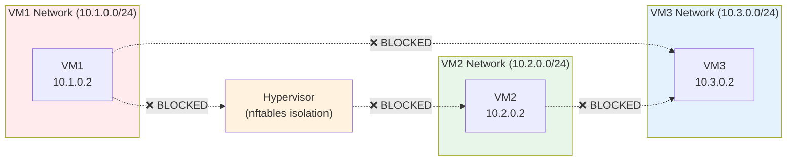
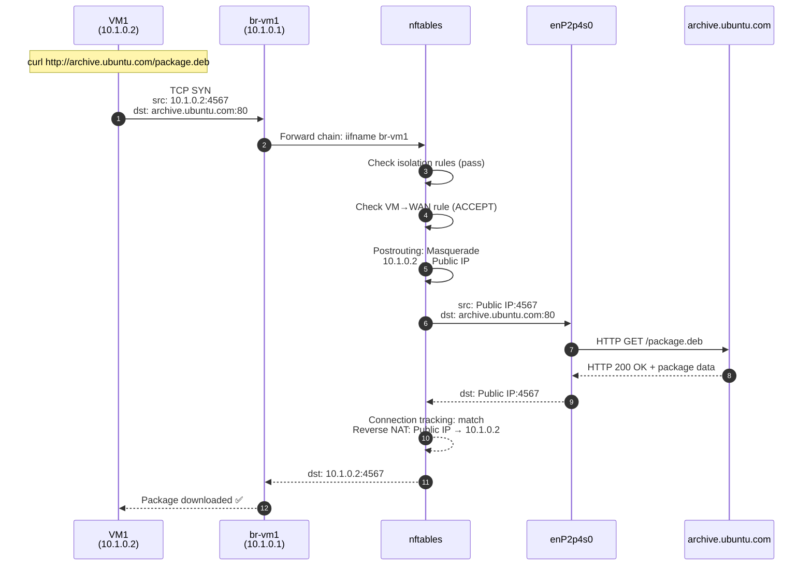
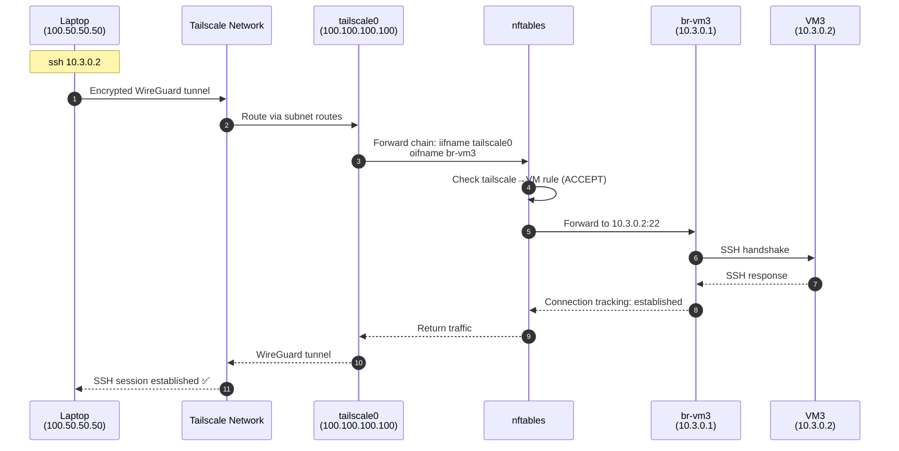
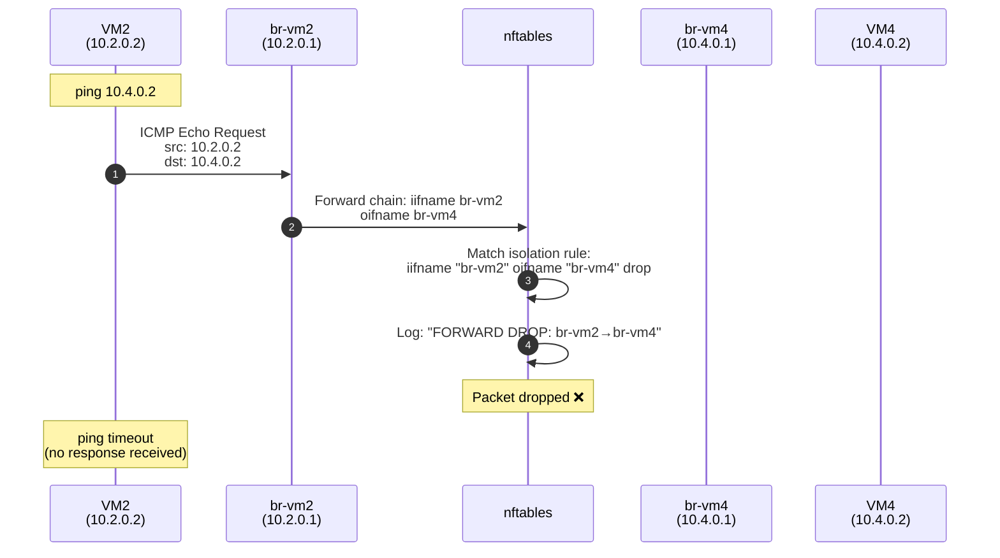
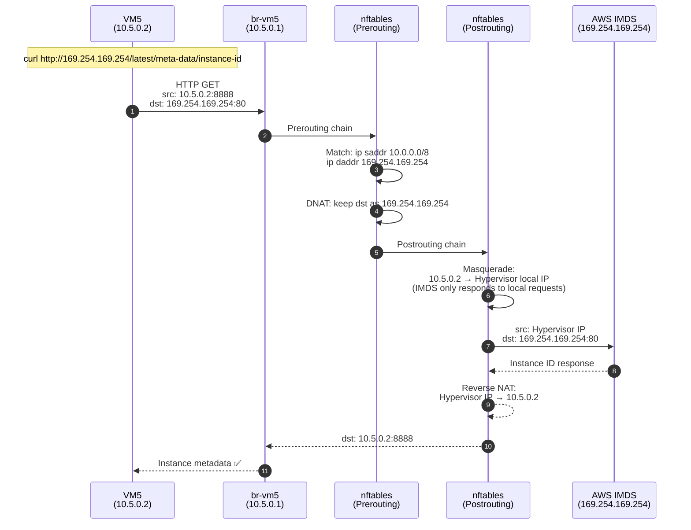

# Network Topology and Architecture

This document provides detailed diagrams and explanations of the network architecture for the MicroVM infrastructure.

## Table of Contents
1. [Physical/Virtual Topology](#physicalvirtual-topology)
2. [Network Traffic Flows](#network-traffic-flows)
3. [nftables Chain Processing](#nftables-chain-processing)
4. [Isolation Mechanism](#isolation-mechanism)
5. [IP Address Allocation](#ip-address-allocation)
6. [Traffic Flow Examples](#traffic-flow-examples)

---

## Physical/Virtual Topology



---

## Network Traffic Flows

### Flow 1: VM to Internet



### Flow 2: VM to AWS IMDS (Metadata Service)


### Flow 3: Remote Access via Tailscale



### Flow 4: VM1 to VM2 (BLOCKED - Isolation)



---

## nftables Chain Processing



---

## Isolation Mechanism

### How VM Isolation Works

The `generateIsolationRules` function creates a rule matrix:

```
Source → Target      br-vm1  br-vm2  br-vm3  br-vm4  br-vm5
─────────────────────────────────────────────────────────────
br-vm1                 -      DROP    DROP    DROP    DROP
br-vm2               DROP      -      DROP    DROP    DROP
br-vm3               DROP    DROP      -      DROP    DROP
br-vm4               DROP    DROP    DROP      -      DROP
br-vm5               DROP    DROP    DROP    DROP      -
```

**Generated nftables rules:**
```nft
iifname "br-vm1" oifname "br-vm2" drop
iifname "br-vm1" oifname "br-vm3" drop
iifname "br-vm1" oifname "br-vm4" drop
iifname "br-vm1" oifname "br-vm5" drop
iifname "br-vm2" oifname "br-vm1" drop
iifname "br-vm2" oifname "br-vm3" drop
# ... (continues for all combinations)
```

**Result:** VMs cannot communicate with each other at Layer 2 or Layer 3. All inter-VM traffic is dropped at the hypervisor's forward chain.

### Isolation Benefits



**Security Benefits:**
- **Attack Surface Reduction**: Compromised VM cannot pivot to other VMs
- **Traffic Isolation**: Each VM's traffic is completely isolated
- **Independent Policies**: Can apply different security policies per VM
- **Compliance**: Meets multi-tenant isolation requirements

---

## IP Address Allocation

### Address Ranges

| Network | Subnet | Bridge IP | VM IP | Gateway | Broadcast | Usable IPs |
|---------|--------|-----------|-------|---------|-----------|------------|
| VM1 | 10.1.0.0/24 | 10.1.0.1 | 10.1.0.2 | 10.1.0.1 | 10.1.0.255 | 10.1.0.2-254 |
| VM2 | 10.2.0.0/24 | 10.2.0.1 | 10.2.0.2 | 10.2.0.1 | 10.2.0.255 | 10.2.0.2-254 |
| VM3 | 10.3.0.0/24 | 10.3.0.1 | 10.3.0.2 | 10.3.0.1 | 10.3.0.255 | 10.3.0.2-254 |
| VM4 | 10.4.0.0/24 | 10.4.0.1 | 10.4.0.2 | 10.4.0.1 | 10.4.0.255 | 10.4.0.2-254 |
| VM5 | 10.5.0.0/24 | 10.5.0.1 | 10.5.0.2 | 10.5.0.1 | 10.5.0.255 | 10.5.0.2-254 |

### Reserved Addresses

- **10.0.0.0/8**: Entire private range used for VMs
- **169.254.169.254**: AWS Instance Metadata Service (IMDS)
- **100.x.x.x/8**: Tailscale CGNAT range (VPN)

### Static IP Configuration

VMs use static IP configuration (no DHCP):

**In VM (systemd-networkd config):**
```nix
systemd.network.networks."10-lan" = {
  matchConfig.Type = "ether";
  address = [ "10.1.0.2/24" ];
  gateway = [ "10.1.0.1" ];
  dns = [ "1.1.1.1" "8.8.8.8" ];
};
```

**Benefits:**
- Predictable IP addresses
- No DHCP server needed
- Faster boot times
- Simplified troubleshooting

---

## Traffic Flow Examples

### Example 1: VM1 Downloads Package from Internet



### Example 2: SSH from Laptop to VM3 via Tailscale



### Example 3: VM2 Tries to Access VM4 (Blocked)



### Example 4: VM5 Accesses AWS IMDS



---

## Key Takeaways

### Architecture Principles

1. **Defense in Depth**: Multiple layers of isolation (bridges, nftables, connection tracking)
2. **Least Privilege**: Default deny policies with explicit allow rules
3. **Network Segmentation**: Each VM in its own /24 subnet
4. **Stateful Inspection**: Connection tracking for return traffic
5. **Atomic Configuration**: All nftables rules update together (no partial states)

### Operational Notes

**Adding a new VM:**
1. Add network definition to `modules/networks.nix`
2. Configuration automatically generates bridge, TAP, isolation rules
3. No manual firewall rule updates needed

**Troubleshooting network issues:**
```bash
# View nftables ruleset
nft list ruleset

# Monitor traffic on bridge
tcpdump -i br-vm1 -n

# Check NAT translations
nft list table ip nat

# View dropped packets
journalctl -k | grep "FORWARD DROP"

# Test connectivity from VM
ssh 10.1.0.2 "ping -c 3 8.8.8.8"
```

**Performance Considerations:**
- TAP interfaces: ~10-40 Gbps throughput
- nftables: Negligible overhead (<1% CPU)
- Connection tracking: Handles 100k+ concurrent connections
- Bridge forwarding: Wire-speed within hypervisor

---

## References

- **nftables wiki**: https://wiki.nftables.org/
- **systemd-networkd**: https://www.freedesktop.org/software/systemd/man/systemd.network.html
- **Linux bridge**: https://wiki.linuxfoundation.org/networking/bridge
- **Tailscale subnet routes**: https://tailscale.com/kb/1019/subnets/
- **AWS IMDS**: https://docs.aws.amazon.com/AWSEC2/latest/UserGuide/ec2-instance-metadata.html
