# Network Topology and Architecture

This document provides detailed diagrams and explanations of the network architecture for the MicroVM infrastructure.

## Table of Contents
1. [Physical/Virtual Topology](#physicalvirtual-topology)
2. [Network Traffic Flows](#network-traffic-flows)
3. [DNS-Based Allowlist Filtering](#dns-based-allowlist-filtering)
4. [nftables Chain Processing](#nftables-chain-processing)
5. [Isolation Mechanism](#isolation-mechanism)
6. [IP Address Allocation](#ip-address-allocation)
7. [Traffic Flow Examples](#traffic-flow-examples)

---

## Physical/Virtual Topology

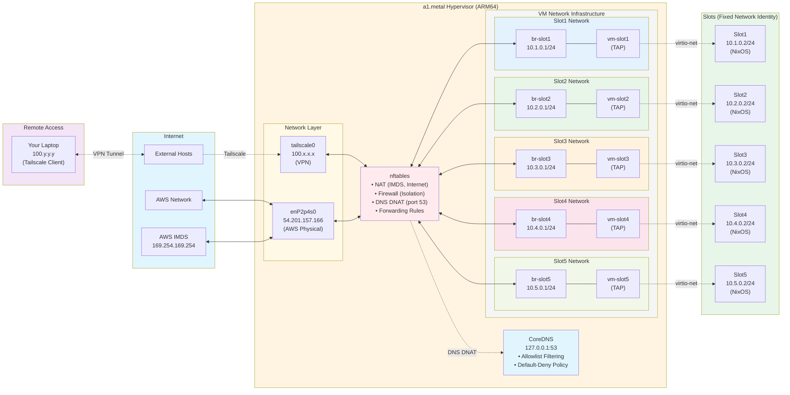

---

## Network Traffic Flows

### Flow 1: Slot to Internet

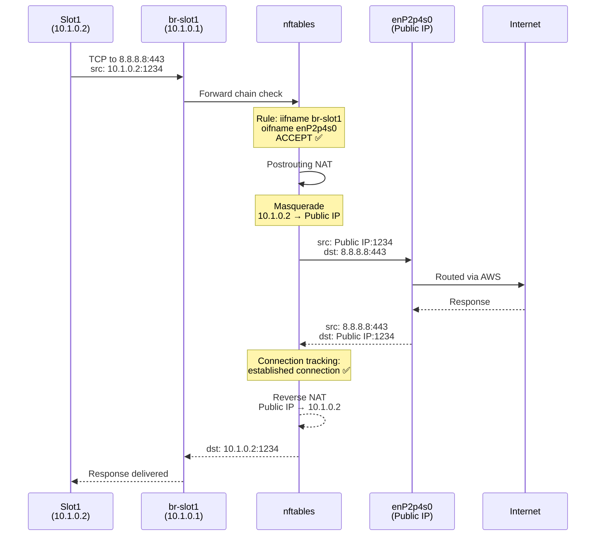

### Flow 2: Slot to AWS IMDS (Metadata Service)

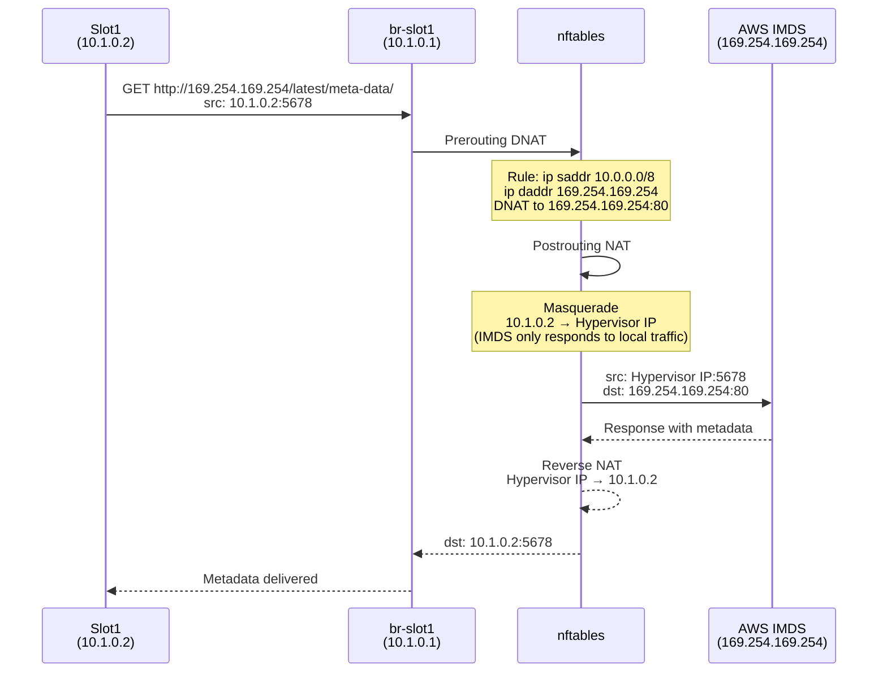

### Flow 3: Remote Access via Tailscale


### Flow 4: Slot1 to Slot2 (BLOCKED - Isolation)

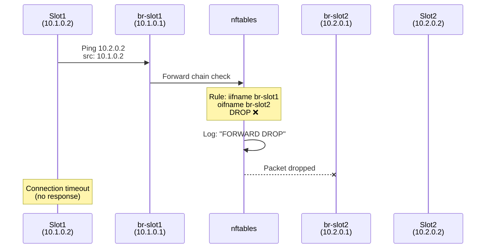

### Flow 5: DNS Query (Allowed Domain)

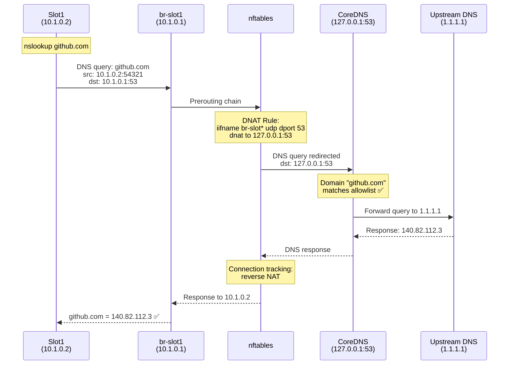

### Flow 6: DNS Query (Blocked Domain)

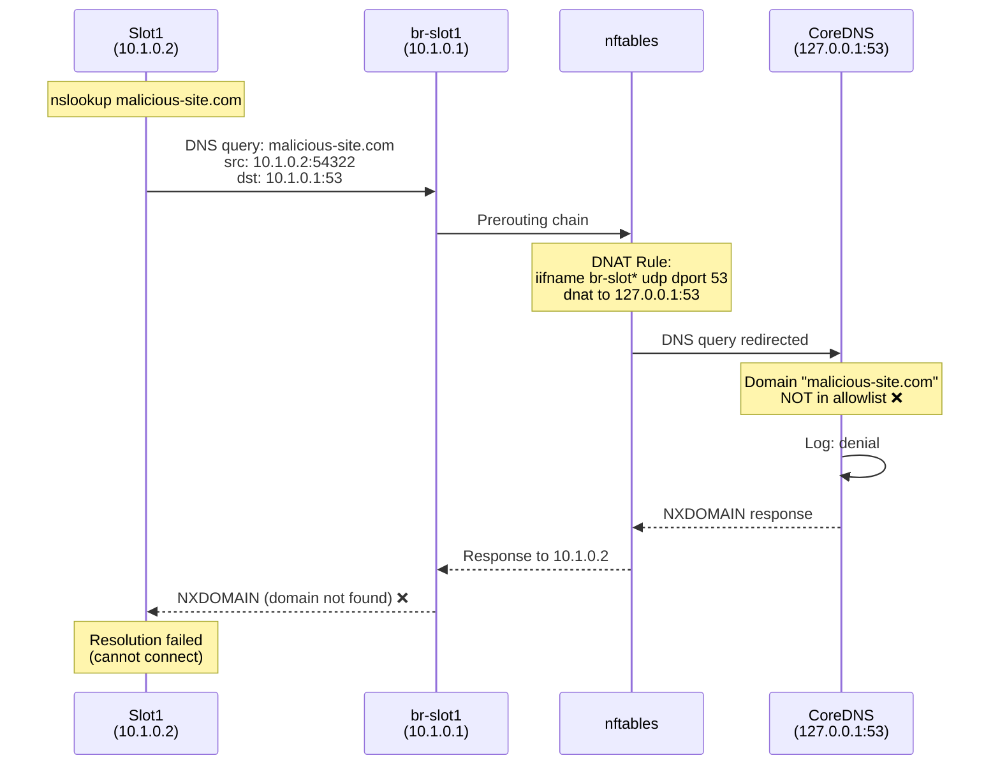

---

## DNS-Based Allowlist Filtering

The infrastructure implements DNS-based egress filtering using CoreDNS. This provides a default-deny policy where slots can only resolve domains on an explicit allowlist.

### Architecture Overview

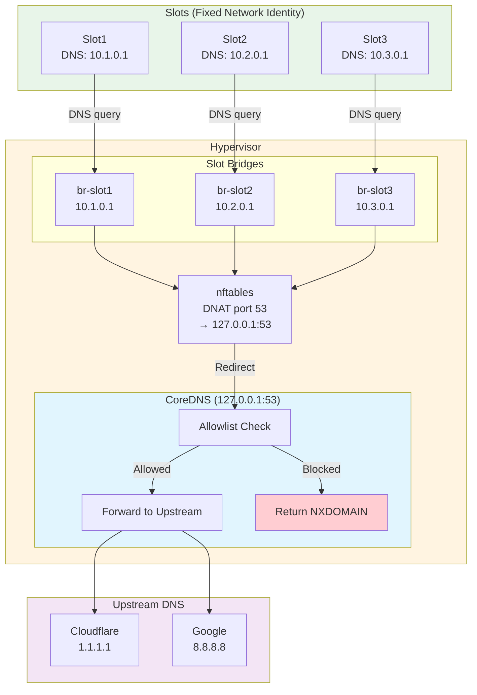

### How DNS Filtering Works

1. **Slot Configuration**: Each slot is configured to use its gateway IP (10.x.0.1) as the DNS resolver
2. **Transparent Interception**: nftables DNAT rules intercept ALL port 53 traffic from slot bridges
3. **Redirection to localhost**: DNS queries are redirected to CoreDNS running on 127.0.0.1:53
4. **Allowlist Check**: CoreDNS checks if the domain is in the allowlist
5. **Forward or Deny**: Allowed domains are forwarded to upstream; blocked domains get NXDOMAIN

### nftables DNAT Rules

```nft
table ip nat {
    chain prerouting {
        type nat hook prerouting priority dstnat;

        # Redirect all DNS traffic from slots to CoreDNS
        iifname { "br-slot1", "br-slot2", "br-slot3", "br-slot4", "br-slot5" } udp dport 53 dnat to 127.0.0.1:53
        iifname { "br-slot1", "br-slot2", "br-slot3", "br-slot4", "br-slot5" } tcp dport 53 dnat to 127.0.0.1:53
    }
}

table inet filter {
    chain forward {
        # Block DNS-over-TLS to prevent bypass
        iifname { "br-slot1", "br-slot2", "br-slot3", "br-slot4", "br-slot5" } tcp dport 853 drop
    }
}
```

**Key Points:**
- Both UDP and TCP DNS are redirected
- DNS-over-TLS (port 853) is explicitly blocked to prevent bypass
- Requires `net.ipv4.conf.all.route_localnet = 1` to allow DNAT to 127.0.0.1

### CoreDNS Configuration

CoreDNS uses a per-domain forward block configuration:

```corefile
# Allowed domain example
github.com:53 {
    bind 127.0.0.1
    forward . 1.1.1.1 8.8.8.8
    cache 300
    log
}

# Default-deny catch-all
.:53 {
    bind 127.0.0.1
    log . {
        class denial
    }
    template ANY ANY {
        rcode NXDOMAIN
    }
}
```

### Allowlist Categories

The allowlist includes domains organized by category:

| Category | Example Domains | Purpose |
|----------|-----------------|---------|
| **Package Registries** | `registry.npmjs.org`, `pypi.org`, `crates.io` | Package downloads |
| **Code Hosting** | `github.com`, `gitlab.com`, `bitbucket.org` | Source code, git operations |
| **Container Registries** | `docker.io`, `ghcr.io`, `quay.io` | Container images |
| **CDNs** | `cloudflare.com`, `fastly.com`, `jsdelivr.net` | Static assets |
| **Linux Repos** | `archive.ubuntu.com`, `deb.debian.org` | System packages |
| **AI Services** | `api.anthropic.com`, `api.openai.com` | AI API access |
| **NixOS** | `cache.nixos.org`, `channels.nixos.org` | Nix packages |
| **Cloud Providers** | `s3.amazonaws.com`, `storage.googleapis.com` | Cloud storage |
| **VPN** | `tailscale.com`, `controlplane.tailscale.com` | VPN connectivity |

**Total Allowed Domains:** ~177 domains (with automatic subdomain coverage)

### DNS Query Flow

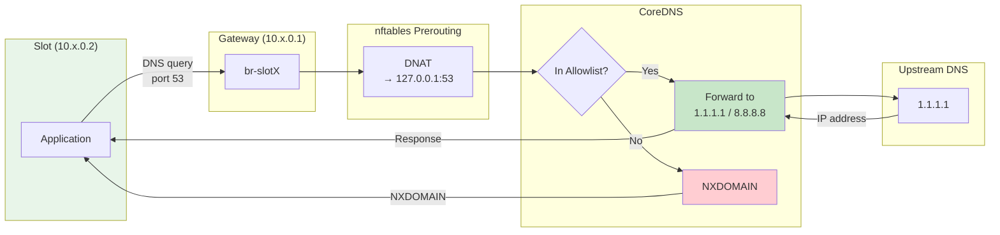

### Security Benefits

1. **Default-Deny Policy**: Only explicitly allowed domains can be resolved
2. **Transparent Enforcement**: Slots cannot bypass filtering - all DNS is intercepted at network layer
3. **DoT Prevention**: DNS-over-TLS is blocked to prevent encrypted DNS bypass
4. **Audit Logging**: All DNS queries (allowed and denied) are logged
5. **Subdomain Coverage**: Allowing `github.com` automatically covers `*.github.com`

### Bypass Prevention

The filtering cannot be bypassed by slots because:

| Bypass Attempt | Prevention |
|----------------|------------|
| Use different DNS server (e.g., 8.8.8.8 directly) | All port 53 traffic is DNAT'd to CoreDNS |
| Use DNS-over-TLS (port 853) | Port 853 is explicitly blocked |
| Use DNS-over-HTTPS (DoH) | Would require HTTPS to a blocked domain |
| Hardcode IP addresses | Only works if attacker knows IPs in advance |

### Troubleshooting DNS Filtering

```bash
# Check CoreDNS status
systemctl status coredns

# View DNS query logs
journalctl -u coredns -f

# Test DNS resolution from slot
ssh 10.1.0.2 "nslookup github.com"      # Should resolve
ssh 10.1.0.2 "nslookup evil-site.com"   # Should fail with NXDOMAIN

# Verify DNAT rules
nft list chain ip nat prerouting

# Check if port 853 is blocked
ssh 10.1.0.2 "nc -zv 1.1.1.1 853"       # Should timeout/fail
```

---

## nftables Chain Processing

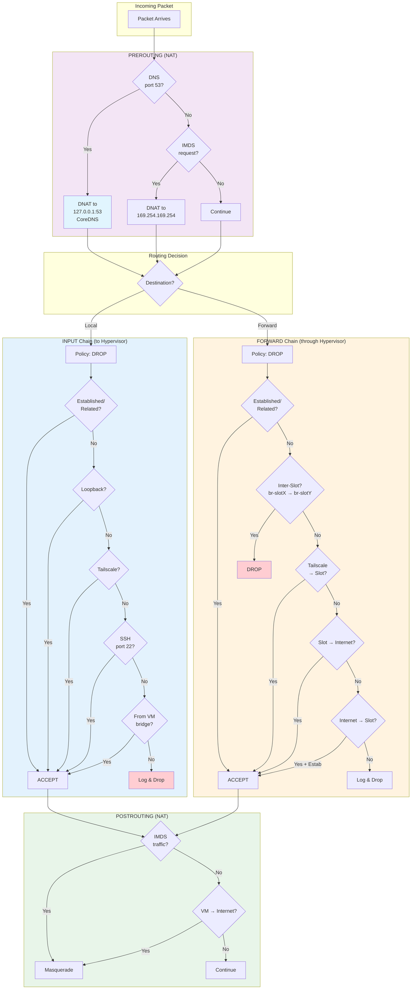

---

## Isolation Mechanism

### How Slot Isolation Works

The `generateIsolationRules` function creates a rule matrix:

```
Source → Target      br-slot1  br-slot2  br-slot3  br-slot4  br-slot5
──────────────────────────────────────────────────────────────────────
br-slot1                 -        DROP      DROP      DROP      DROP
br-slot2               DROP         -       DROP      DROP      DROP
br-slot3               DROP       DROP        -       DROP      DROP
br-slot4               DROP       DROP      DROP        -       DROP
br-slot5               DROP       DROP      DROP      DROP        -
```

**Generated nftables rules:**
```nft
iifname "br-slot1" oifname "br-slot2" drop
iifname "br-slot1" oifname "br-slot3" drop
iifname "br-slot1" oifname "br-slot4" drop
iifname "br-slot1" oifname "br-slot5" drop
iifname "br-slot2" oifname "br-slot1" drop
iifname "br-slot2" oifname "br-slot3" drop
# ... (continues for all combinations)
```

**Result:** Slots cannot communicate with each other at Layer 2 or Layer 3. All inter-slot traffic is dropped at the hypervisor's forward chain.

### Isolation Benefits

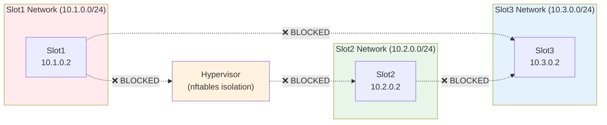

**Security Benefits:**
- **Attack Surface Reduction**: Compromised slot cannot pivot to other slots
- **Traffic Isolation**: Each slot's traffic is completely isolated
- **Independent Policies**: Can apply different security policies per slot
- **Compliance**: Meets multi-tenant isolation requirements

---

## IP Address Allocation

### Address Ranges

| Network | Subnet | Bridge IP | Slot IP | Gateway | Broadcast | Usable IPs |
|---------|--------|-----------|---------|---------|-----------|------------|
| Slot1 | 10.1.0.0/24 | 10.1.0.1 | 10.1.0.2 | 10.1.0.1 | 10.1.0.255 | 10.1.0.2-254 |
| Slot2 | 10.2.0.0/24 | 10.2.0.1 | 10.2.0.2 | 10.2.0.1 | 10.2.0.255 | 10.2.0.2-254 |
| Slot3 | 10.3.0.0/24 | 10.3.0.1 | 10.3.0.2 | 10.3.0.1 | 10.3.0.255 | 10.3.0.2-254 |
| Slot4 | 10.4.0.0/24 | 10.4.0.1 | 10.4.0.2 | 10.4.0.1 | 10.4.0.255 | 10.4.0.2-254 |
| Slot5 | 10.5.0.0/24 | 10.5.0.1 | 10.5.0.2 | 10.5.0.1 | 10.5.0.255 | 10.5.0.2-254 |

### Reserved Addresses

- **10.0.0.0/8**: Entire private range used for slots
- **169.254.169.254**: AWS Instance Metadata Service (IMDS)
- **100.x.x.x/8**: Tailscale CGNAT range (VPN)

### Static IP Configuration

Slots use static IP configuration (no DHCP):

**In slot (systemd-networkd config):**
```nix
systemd.network.networks."10-lan" = {
  matchConfig.Type = "ether";
  address = [ "10.1.0.2/24" ];
  gateway = [ "10.1.0.1" ];
  dns = [ "10.1.0.1" ];  # Points to gateway for DNS filtering
};
```

**Benefits:**
- Predictable IP addresses
- No DHCP server needed
- Faster boot times
- Simplified troubleshooting
- DNS queries routed through allowlist filtering

---

## Traffic Flow Examples

### Example 1: Slot1 Downloads Package from Internet

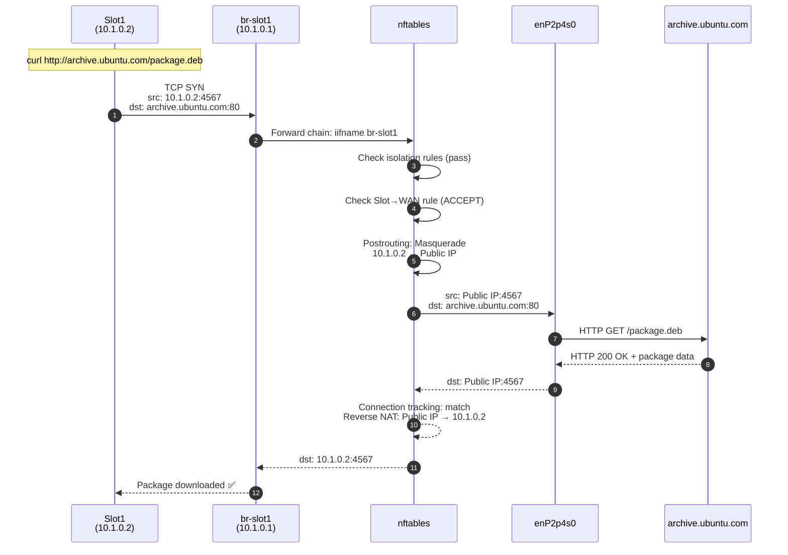

### Example 2: SSH from Laptop to Slot3 via Tailscale


### Example 3: Slot2 Tries to Access Slot4 (Blocked)

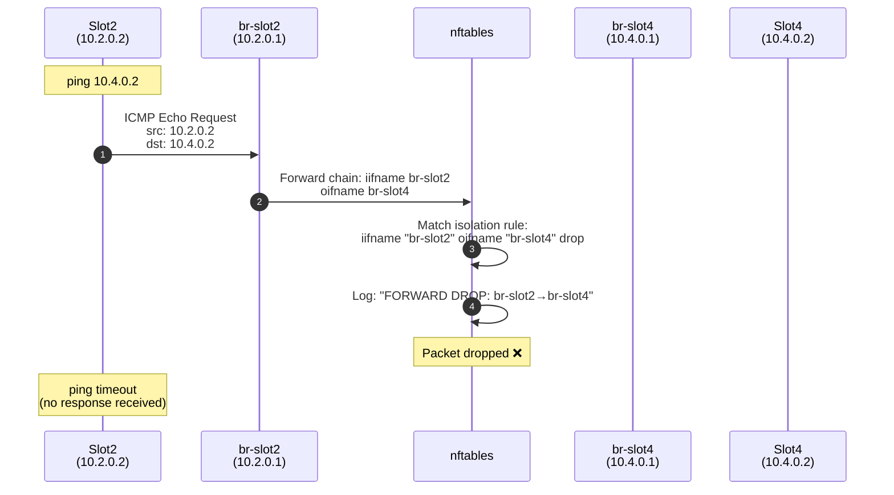

### Example 4: Slot5 Accesses AWS IMDS


---

## Key Takeaways

### Architecture Principles

1. **Defense in Depth**: Multiple layers of isolation (bridges, nftables, DNS filtering, connection tracking)
2. **Least Privilege**: Default deny policies with explicit allow rules
3. **Network Segmentation**: Each slot in its own /24 subnet
4. **Stateful Inspection**: Connection tracking for return traffic
5. **Atomic Configuration**: All nftables rules update together (no partial states)
6. **DNS-Based Egress Control**: Allowlist filtering prevents unauthorized external access
7. **Portable State**: States can be snapshotted and migrated between slots

### Operational Notes

**Adding a new slot:**
1. Add network definition to `modules/networks.nix`
2. Configuration automatically generates bridge, TAP, isolation rules
3. No manual firewall rule updates needed

**Troubleshooting network issues:**
```bash
# View nftables ruleset
nft list ruleset

# Monitor traffic on bridge
tcpdump -i br-slot1 -n

# Check NAT translations
nft list table ip nat

# View dropped packets
journalctl -k | grep "FORWARD DROP"

# Test connectivity from slot
ssh 10.1.0.2 "ping -c 3 8.8.8.8"
```

**Troubleshooting DNS filtering:**
```bash
# Check CoreDNS service status
systemctl status coredns

# View DNS query logs (allowed and denied)
journalctl -u coredns -f

# Test allowed domain resolution
ssh 10.1.0.2 "nslookup github.com"

# Test blocked domain (should return NXDOMAIN)
ssh 10.1.0.2 "nslookup blocked-site.com"

# Verify DNS DNAT rules
nft list chain ip nat prerouting | grep "dport 53"

# Check if DoT is blocked
ssh 10.1.0.2 "timeout 3 nc -zv 1.1.1.1 853"
```

**Performance Considerations:**
- TAP interfaces: ~10-40 Gbps throughput
- nftables: Negligible overhead (<1% CPU)
- Connection tracking: Handles 100k+ concurrent connections
- Bridge forwarding: Wire-speed within hypervisor

---

## References

- **nftables wiki**: https://wiki.nftables.org/
- **CoreDNS documentation**: https://coredns.io/manual/toc/
- **CoreDNS plugins**: https://coredns.io/plugins/
- **systemd-networkd**: https://www.freedesktop.org/software/systemd/man/systemd.network.html
- **Linux bridge**: https://wiki.linuxfoundation.org/networking/bridge
- **Tailscale subnet routes**: https://tailscale.com/kb/1019/subnets/
- **AWS IMDS**: https://docs.aws.amazon.com/AWSEC2/latest/UserGuide/ec2-instance-metadata.html
